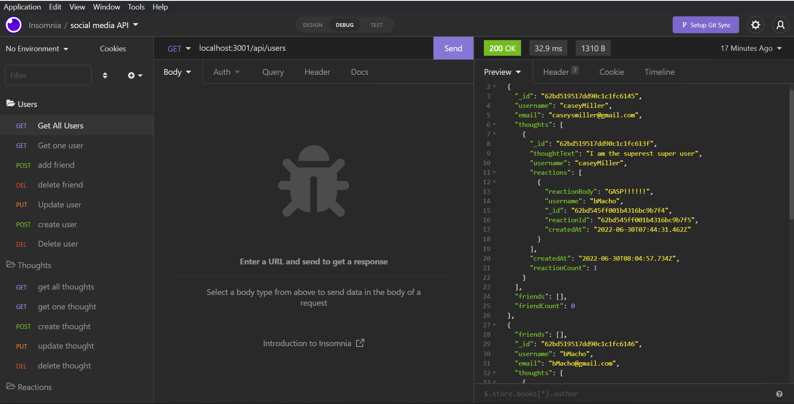

# NoSQL Challenge: Social Network API

  ## Description
  
  Module 18, NoSQL Challenge: Social Network API, due 6/29/2022. This is a social network backend api.
  
  ## License
  
  Developed under Mit License 
  
  ## Table of Contents
  
  - [Description](#description)
  - [Installation](#installation)
  - [Usage](#usage)
  - [Contributing](#contributing)
  - [License](#license)
  - [Test Instructions](#tests)
  
  ## Installation
  
  1. Clone the repo. 
  2. Run `npm i` to install the modules. 
  3. Install mongoDb on your machine if you do not already have it.
  4. Run `npm run start` to set up the server. 
  5. Exit the server. 
  6. Run `npm run seed` to seed the database. 
  7. Restart the server.
  
  [Demo Video](https://www.youtube.com/watch?v=9uxWzN92hBk "Install and Usage Video")
  
  
  
  ## Usage
  
  This is a backend API for a social network platform. Users can be created, updated and deleted. Users can link to other users as friends. Thoughts can be created and will be linked to the associated user and others can post reactions to thoughts.
  
  ## Screenshot
  
  
  
  ## Contributing
  
  Send an email to the address below to contribute.
  
  ## Tests
  
  Once the application is installed and running it can be tested using Insomnia. The test routes can be imported to insomnia from the Insomnia_test_routes.json file in the assets folder. All user, thought and reaction Id's will have to be updated beacause they will be generated when the database is seeded.
  
  ---
  
  ## My GitHub
  
  [CaseySMiller](https://github.com/CaseySMiller)
  
  ## Email me
  
  [CaseySMiller@yahoo.com](mailto:CaseySMiller@yahoo.com)

